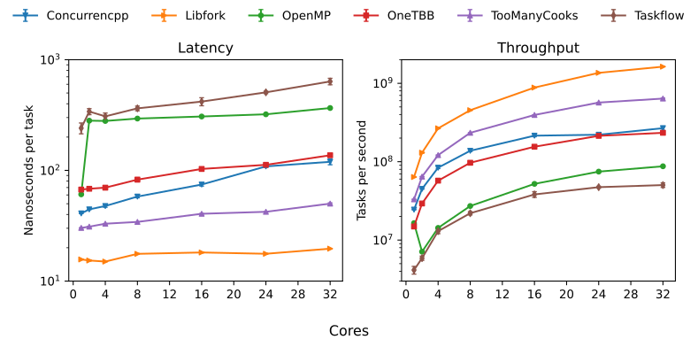
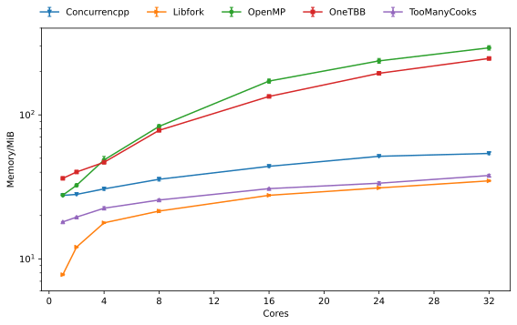

<h1 align="center"> Welcome to <tt>libfork</tt> 🍴 </h1>

<p align="center">
<a href="https://github.com/ConorWilliams/libfork/actions/workflows/linux.yml">
    
</a>
<a href="https://github.com/ConorWilliams/libfork/actions/workflows/windows.yml">
    
</a>
<a href="https://github.com/ConorWilliams/libfork/actions/workflows/macos.yml">
    
</a>
<a href="https://github.com/ConorWilliams/libfork/actions/workflows/pages/pages-build-deployment">
    
</a>
<a href="https://codecov.io/gh/ConorWilliams/libfork">
    
</a>
</p>

<p align="center">
  A bleeding edge, lock-free, wait-free, continuation-stealing coroutine-tasking library.
</p>

<h3 align="center"> ** Now supplying 🌵! **  </h1>

<h3 align="center"> ** This branch is an experiment **  </h1>

Libfork is primarily an abstraction for fully-portable, strict, [fork-join parallelism](https://en.wikipedia.org/wiki/Fork%E2%80%93join_model). This is made possible without the use of any macros/inline assembly using C++20's coroutines. Ultra-fine grained parallelism (the ability to spawn tasks with very low overhead) is enabled by an innovative implementation of an (almost) non-allocating [cactus-stack](https://en.wikipedia.org/wiki/Parent_pointer_tree) utilizing _segmented stacks_. Libfork presents a cross-platform API that decouples scheduling tasks (a customization point) from writing tasks. Additionally, libfork provides performant NUMA-aware work-stealing schedulers for general use. If you'd like to learn more check out [the tour of libfork](#a-tour-of-libfork) then try it on [compiler explorer](https://godbolt.org/z/nTeGT34Gv) or, just grok the __TLDR__:

```cpp
#include "libfork/core.hpp"

inline constexpr auto fib = [](auto fib, int n) -> lf::task<int> { 
  
  if (n < 2) {
    co_return n;
  }

  int a, b;

  co_await lf::fork[&a, fib](n - 1);    // Spawn a child task.
  co_await lf::call[&b, fib](n - 2);    // Execute a child inline.

  co_await lf::join;                    // Wait for children.

  co_return a + b;                      // Safe to read after a join.
};
```

## Performance

Libfork is engineered for performance and has a comprehensive [benchmark suit](bench). For a detailed review of libfork on  1-112 cores see the [paper](https://arxiv.org/abs/2402.18480), the headline results are __linear time/memory scaling__, this translates to:

- Up to 7.5× faster and 19× less memory consumption than OneTBB.
- Up to 24× faster and 24× less memory consumption than openMP (libomp).
- Up to 100× faster and >100× less memory consumption than taskflow.

### Scheduler overhead

For a quick comparison with other libraries, the average time to spawn/run a task during the recursive Fibonacci benchmark gives a good approximation to the tasking overhead and peak throughput:

<p align="center">
  
</p>

### Memory consumption

Libfork is competitive with other libraries in terms of memory consumption; below is the peak (physical) memory allocation during the T3L [unbalanced tree search](https://doi.org/10.1007/978-3-540-72521-3_18) benchmark:

<details>

<summary>View graph</summary>

<p align="center">
  
</p>

</details>

## Using libfork

Libfork is a header-only library with full CMake support and zero required-dependencies. Refer to the [BUILDING](BUILDING.md) document for full details on compiling the tests/benchmarks/docs, installation, optional dependencies and, tools for developers. See below for the easiest ways to consume libfork in your CMake projects.

### Package managers

We recommend consuming libfork via a package manager, this streamlines the management of optional dependencies.

#### vcpkg

Libfork is available via vcpkg. Add the following to your `vcpkg.json`:

```json
"dependencies": [
    "libfork"
]
```

You may then use the library in your project's cmake:

```cmake
find_package(libfork CONFIG REQUIRED)  

target_link_libraries(
    project_target PRIVATE libfork::libfork
)
```

__NOTE:__ The libfork port in vcpkg is kept up to date by Microsoft team members and community contributors. If the version is out of date, please [create an issue or pull request](https://github.com/Microsoft/vcpkg) on the vcpkg repository.

#### Conan2

Libfork is available in Conan Center Index, to install the latest version run (Please make sure that you use a c++20 ready conan profile!):

```sh
conan install --requires="libfork/[*]" --build=missing
```

Or add `libfork/[*]` to your conanfile recipe requirements.

You may then use the library in your project's cmake:

```cmake
find_package(libfork CONFIG REQUIRED)  

target_link_libraries(
    project_target PRIVATE libfork::libfork
)
```

__NOTE:__ The libfork recipe in Conan is kept up to date by Conan team members and community contributors. If the version is out of date, please [create an issue or pull request](https://github.com/conan-io/conan-center-index) on the Conan repository.

### With CMake

If you have installed libfork from source, following the [BUILDING](BUILDING.md) document, then you can use the following CMake code to consume libfork in your project:

```cmake
find_package(libfork CONFIG REQUIRED)

target_link_libraries(
    project_target PRIVATE libfork::libfork
)
```

#### Using CMake's ``FetchContent``

If you have not installed libfork you may use CMake's `FetchContent` to download and build libfork as part of your project:

```cmake
include(FetchContent)

FetchContent_Declare(
    libfork
    GIT_REPOSITORY https://github.com/conorwilliams/libfork.git
    GIT_TAG v3.7.2
    GIT_SHALLOW TRUE
)

FetchContent_MakeAvailable(libfork)

target_link_libraries(
    project_target PRIVATE libfork::libfork
)
```

## API reference

See the generated [docs](https://conorwilliams.github.io/libfork/).

## Contributing

1. Read the [CODE_OF_CONDUCT](CODE_OF_CONDUCT.md) document.
2. Read the [BUILDING](BUILDING.md) document.
3. Have a snoop around the `impl` namespace.
4. Ask as many questions as you can think of!

## Changelog

See the [ChangeLog](ChangeLog.md) document.

## Star History

[](https://www.star-history.com/#conorwilliams/libfork&type=date&legend=top-left)
