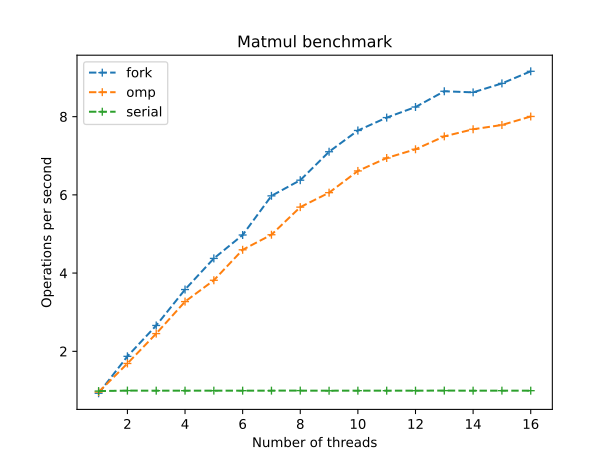
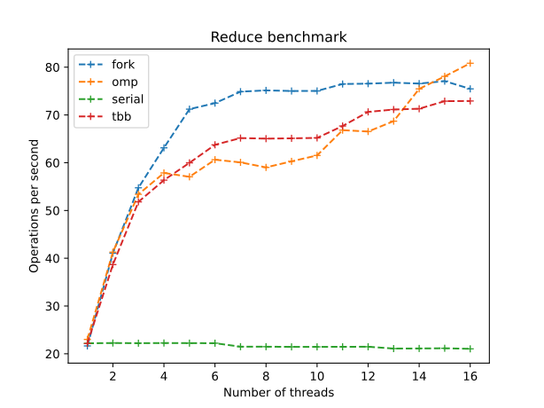

# Benchmarks

Benchmarking is hard! The result depend fairly strongly on the compiler + machine. Especially as compiler optimization of coroutines in C++ is relatively unpredictable with HALO. Furthermore, extra caution is needed when linking to external libraries (e.g. Intel's TBB) that may be compiled with different compilers and flags.

As an example, based on my testing with GCC-12, it seems that GCC currently uses a single job queue for openMP tasking which rapidly becomes a bottleneck causing the Fibonacci and dfs benchmarks to slow down as the number of threads increases. Additionally, during the matmul and reduce benchmarks, libfork generated ~100% more cache-misses than TBB and OMP. I have no idea why!

The following benchmarks were performed on an Intel(R) Xeon(R) CPU E5-2670 0 @ 2.60GHz (8 cores, 16 threads) using Clang-17[^1] and ``libstdc++`` with the optimisation flags: ``-march=native -O3 -DNDEBUG -flto=auto``.

[^1]: Built from commit SHA ``561d9cd6f457827bb81fcd036343ad14ec70f89c``

The optimal parallel execution, $T(n)$, time according to [Amdahl's law](https://en.wikipedia.org/wiki/Amdahl%27s_law) is:
$$
\frac{T(n)}{T(1)}=(1-p)+{\frac{p}{n}}.
$$
with $n$ the number of threads uses and $p$ the parallelisable portion of the work. Hence plotting $\ln{T(n)}$ against $\ln{n}$ we should expect a straight line with gradient $-1$.

# Fibonacci (fib)

This benchmark is from [Weave](https://github.com/mratsim/weave), it evenly spawns many-tasks that do almost no computation hence, this benchmark predominantly test creation/scheduling/deletion overhead.

Fibonacci benchmark has 3 draws:

1. It's very simple to implement
2. It's unbalanced and efficiency requires distributions to avoid idle cores.
3. It's a very effective scheduler overhead benchmark, because the basic task is very trivial and the task spawning grows at 2^n scale.

⚠️ Disclaimer:
   Please don't use parallel Fibonacci in production!
   Use the fast doubling method with memoization instead.

## Results and discussion

Here we compute the 30th Fibonacci number. We see that the serial performance is much higher than the parallel performance as the overhead of creating and scheduling tasks is significant. Libfork is the fastest scheduler over the range and scales perfectly. Intel's TBB exhibits good scaling but has some instability at high thread counts. OpenMP is the slowest scheduler and has a very poor scaling, two threads are slower than one!

# Depth first search (dfs)

From [Staccato](https://github.com/rkuchumov/staccato), this benchmark also spawns many tasks in a broader, shallower tree. Similar to Fibonacci it primarily tests scheduler overhead however, some schedulers will have an easier time with the broader fan-out.

## Results and discussion

Here with a 7 by 7 tree (7 branches per node, leaf nodes are 7 branches from the root) the results follow the same pattern as the Fibonacci benchmark.

# Cache oblivious matrix multiplication (matmul)

From [Staccato](https://github.com/rkuchumov/staccato) and Cilk, see the paper ``Cache-Oblivious Algorithms'', by Matteo Frigo, Charles E. Leiserson, Harald Prokop, and Sridhar Ramachandran, FOCS 1999, for an explanation of why this algorithm is good for caches.

This benchmark recursively subdivides a matrix before computing a matrix multiplication, hence it test a balance of CPU/memory/scheduler overhead.

## Results and discussion

For this benchmark computing the product of two 1024x1024 matrices we see the schedulers perform very similarly as expected for a higher workload.

Note the TBB tests segfaults here? I have no idea why.

# Reduction (reduce)

This benchmark computes the sum of 100'000'000 numbers in an array. For smaller arrays it is CPU bound and tests scheduler overhead, for larger arrays it should become memory bound. In theory this is almost perfectly parallelisable and spawns very few task hence all candidates should perform similarly.

## Results and discussion

As expected, the schedulers perform very similarly over the range 1-8 threads however, the performance drops off significantly above 8 threads. This is likely due to the memory bandwidth being saturated. Libfork, as a continuation stealer, does a bit better than the other schedulers as it keeps better task cache access patterns.