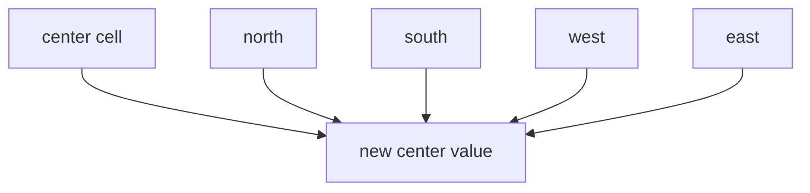

# Heat

The heat benchmark applies a two-dimensional Jacobi stencil to a square grid:

```cpp linenums="1"
dst[y, x] = 0.25 * (src[y, x - 1] + src[y, x + 1]
                  + src[y - 1, x] + src[y + 1, x]);
```

The boundary cells are clamped. The initial grid is a deterministic analytic
profile, and the benchmark checks the final grid after a fixed number of
iterations.



Each update reads only the four direct neighbors from the previous grid and
writes one cell in the next grid. That local stencil is why neighboring rows or
tiles tend to reuse cache lines well, while each time step still needs a global
swap before the next step can begin.

## Complexity

For an \(n \times n\) grid and \(k\) iterations, the work is:

\[
T_1 = \mathcal{O}(k n^2)
\]

Each time step depends on the previous one, so the span contains the iteration
loop. Within a single step, the interior cells are independent:

\[
T_\infty = \mathcal{O}(k)
\]

The benchmark uses two grids, so the space complexity is \(\mathcal{O}(n^2)\).

## Scaling

Heat is a regular bulk-parallel stencil. It should distribute evenly across
workers because every interior cell performs the same amount of arithmetic.

Scaling is normally limited by memory bandwidth and cache behavior rather than
scheduler imbalance. The global iteration barrier between stencil steps also
prevents parallelism across time.

This is the most regular bulk-parallel benchmark in the suite, and is a useful
contrast with irregular per-element workloads such as [Mandelbrot](mandelbrot.md).

## Benchmark sizes

The following problem sizes are available:

| Name | Grid | Iterations |
|------|------|------------|
| test | `64 x 64` | `16` |
| base | `1024 x 1024` | `16` |

## Results

TODO: results
