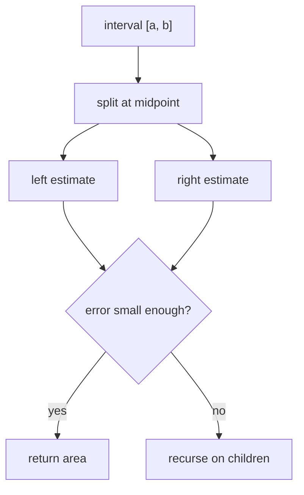

# Integrate

The integrate benchmark computes the definite integral of:

\[
f(x) = (x^2 + 1)x
\]

over the interval \([0, n]\). It uses adaptive recursive trapezoidal
quadrature: split the interval in half, compare the combined child estimate
with the parent estimate, and recurse until the error is below the configured
tolerance.

## Complexity

The amount of work depends on how many sub-intervals the adaptive test accepts.
If \(m\) leaf intervals are produced, then the recursion tree has linear size:

\[
T_1 = \mathcal{O}(m)
\]

The span is proportional to the deepest refinement path:

\[
T_\infty = \mathcal{O}(d)
\]

where \(d\) is the maximum recursion depth. Smooth regions terminate quickly;
regions requiring more refinement create a deeper, more irregular task graph.

## Scaling

Adaptive integration is an irregular divide-and-conquer benchmark. The two
children of a split may perform different amounts of future work, so good
scheduling depends on exposing enough small subproblems without making the
tasks too fine grained.

The benchmark also checks the result against the exact antiderivative, so
incorrect pruning or floating-point instability is caught.

It is similar to [UTS](uts.md) in that the useful task graph is discovered
recursively, but here the irregularity comes from numerical error rather than
tree-generation randomness.

## Benchmark sizes

The following problem sizes are available:

| Name | Upper bound `n` | Tolerance |
|------|------------------|-----------|
| test | `100` | `1.0e-9` |
| base | `10'000` | `1.0e-9` |

## Results

TODO: results
