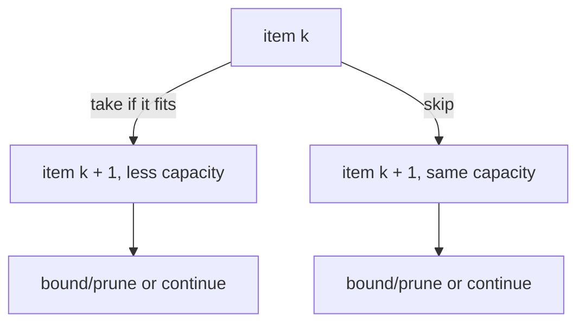

# Knapsack

The knapsack benchmark solves the exact
[0/1 knapsack problem](https://en.wikipedia.org/wiki/Knapsack_problem). Given
items with weights and values, choose a subset whose total weight is at most
the knapsack capacity and whose total value is as large as possible. In the 0/1
version, each item can be taken once or skipped.

Items are generated deterministically, sorted by value density, and the
capacity is set to half the total item weight.

At each item, the search either takes the item, if it fits, or skips it. A
fractional-knapsack relaxation gives an upper bound; subtrees whose bound cannot
beat the current best solution are pruned.

## Complexity

In the worst case, the search explores both choices for every item:

\[
T_1 = \mathcal{O}(2^n)
\]

The branch-and-bound relaxation can make practical work much smaller, but the
amount of pruning is input dependent. The maximum recursion depth is linear:

\[
T_\infty = \mathcal{O}(n)
\]

The serial benchmark validates the answer against a dynamic-programming oracle.

## Scaling

Knapsack is an irregular search benchmark. Early branches may discover a strong
incumbent and prune later work, while other branches may remain large. This
makes task sizes unpredictable.

A parallel implementation must also coordinate updates to the current best
value. More frequent updates improve pruning but can increase contention.

Knapsack is similar to [N-Queens](nqueens.md) and [UTS](uts.md): it is a search
problem whose task graph is discovered as the computation runs.

## Benchmark sizes

The following problem sizes are available:

| Name | Items |
|------|-------|
| test | `16` |
| base | `28` |

## Results

TODO: results
