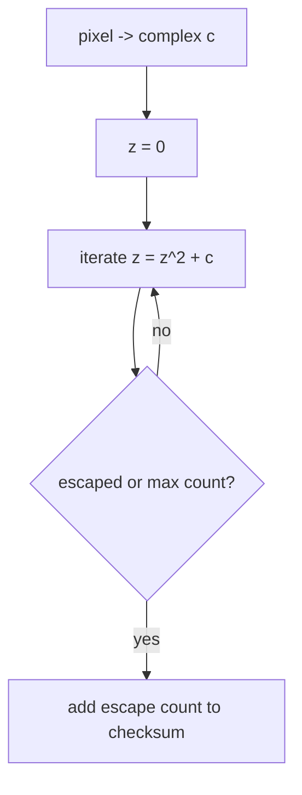

# Mandelbrot

The [Mandelbrot set](https://en.wikipedia.org/wiki/Mandelbrot_set) is the set
of complex parameters \(c\) for which repeated iteration of
\(z_{k + 1} = z_k^2 + c\), starting from \(z_0 = 0\), remains bounded. Its
fractal image comes from coloring nearby points by how quickly they escape.

The benchmark computes an escape-time image over the rectangle
\([-2, 1] \times [-1.5, 1.5]\). Each pixel iterates:

\[
z_{k + 1} = z_k^2 + c
\]

until either \(|z|^2 > 4\) or the maximum iteration count is reached. The
benchmark sums all per-pixel iteration counts as a checksum.

## Complexity

For an \(n \times n\) image and maximum iteration count \(m\), the worst-case
work is:

\[
T_1 = \mathcal{O}(n^2 m)
\]

Pixels are independent, so the ideal span for the pixel work is constant apart
from reduction and scheduling overhead:

\[
T_\infty = \mathcal{O}(\log n)
\]

The actual work is lower than the worst case because many pixels escape before
the maximum iteration count.

## Scaling

Mandelbrot is a wide data-parallel workload with irregular per-pixel costs.
Pixels inside or near the set run longer than pixels far outside it.

Fine-grained scheduling improves load balance near the boundary of the set, but
too much granularity makes task overhead dominate. Chunking by rows or tiles is
usually the key scaling tradeoff.

This benchmark is related to [primes](primes.md): both are wide data-parallel
loops whose per-element runtime varies.

## Benchmark sizes

The following problem sizes are available:

| Name | Image | Max iterations |
|------|-------|----------------|
| test | `128 x 128` | `256` |
| base | `1024 x 1024` | `256` |

## Results

TODO: results
