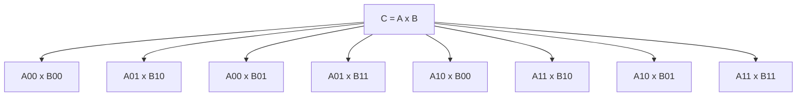

# Matrix Multiply

The matrix multiply benchmark computes `C = A * B` for square `float`
matrices. The serial implementation is recursive divide and conquer: split each
matrix into quadrants, compute the eight half-size products, and add the second
wave of products into the output quadrants.

\[
\begin{bmatrix}
C_{00} & C_{01} \\
C_{10} & C_{11}
\end{bmatrix}
=
\begin{bmatrix}
A_{00} & A_{01} \\
A_{10} & A_{11}
\end{bmatrix}
\begin{bmatrix}
B_{00} & B_{01} \\
B_{10} & B_{11}
\end{bmatrix}
\]

For example:

\[
C_{00} = A_{00}B_{00} + A_{01}B_{10}
\]



The recursion stops at a conventional cubic base case:

```cpp linenums="1"
for (unsigned i = 0; i < n; ++i)
  for (unsigned j = 0; j < n; ++j)
    for (unsigned k = 0; k < n; ++k)
      C[i, j] += A[i, k] * B[k, j];
```

## Complexity

The recursive algorithm does eight multiplication subproblems of half the size.
There is also quadratic work to combine quadrants:

\[
T_1(n) = 8T_1(n / 2) + \mathcal{O}(n^2)
\]

At recursion level \(k\), there are \(8^k\) subproblems of size \(n / 2^k\).
At the leaves, \(k = \log_2 n\), so the number of scalar-sized multiplication
subproblems is:

\[
8^{\log_2 n} = n^{\log_2 8} = n^3
\]

The lower-order \(\mathcal{O}(n^2)\) combine work does not change the result:

\[
T_1 = \mathcal{O}(n^3)
\]

If the independent products at each level are exposed as tasks, the critical
path follows one product per level down to the base case:

\[
T_\infty = \mathcal{O}(\log n)
\]

with a constant factor from the base-case multiply.

## Scaling

Matrix multiply has high arithmetic intensity at large sizes, so there is
substantial parallel work. The task graph is regular: every recursive split
creates products of the same shape.

The benchmark is intentionally not a tuned BLAS kernel. Scaling can still be
limited by cache locality, write traffic when accumulating output quadrants,
and the chosen base-case size.

This benchmark is structurally similar to [Strassen](strassen.md), but uses
the classical eight-product recurrence instead of Strassen's seven products.

## Benchmark sizes

The following problem sizes are available:

| Name | Matrix size | Base case |
|------|-------------|-----------|
| test | `64 x 64` | `32 x 32` |
| base | `1024 x 1024` | `32 x 32` |

## Results

TODO: results
