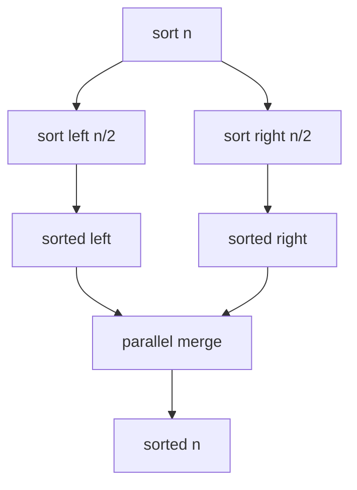

# Merge Sort

The mergesort benchmark stably sorts a deterministic random array of 32-bit
unsigned integers. The serial projection is top-down mergesort:

```cpp linenums="1"
sort(first, mid);
sort(mid, last);
merge(first, mid, last);
```

Small partitions are handled by insertion sort. A scratch buffer is allocated
once per benchmark iteration and threaded through the recursion.

The intended parallel version follows
[Cilksort](https://publications.csail.mit.edu/lcs/pubs/pdf/MIT-LCS-TR-785.pdf):
recursively sort four independent quarters, merge adjacent quarters in
parallel, then merge the two sorted halves with a parallel merge. A typical
parallel merge chooses the median of the larger range, binary searches for its
position in the other range, and recursively merges the two independent output
halves.



## Complexity

Mergesort splits the input in half and performs linear merge work at each level:

\[
T_1(n) = 2T_1(n / 2) + \mathcal{O}(n)
\]

so the work is:

\[
T_1 = \mathcal{O}(n \log n)
\]

The benchmark uses an auxiliary buffer, so the extra space is
\(\mathcal{O}(n)\). With a serial merge, the span would be
\(\mathcal{O}(n)\). With a parallel binary-splitting merge, the merge span is
polylogarithmic, and the full Cilksort-style algorithm has much more available
parallelism.

## Scaling

Mergesort exposes regular divide-and-conquer parallelism in the two recursive
sorts. Unlike quicksort, the split sizes are predictable, so the task graph is
balanced.

The merge step is memory-bandwidth heavy and can become the scaling limit. The
base-case cutoff also matters: small tasks increase scheduling overhead, while
large tasks reduce available parallelism near the leaves.

This benchmark is the balanced counterpart to [quicksort](quicksort.md). It
does more copying, but it avoids pivot-dependent imbalance.

## Benchmark sizes

The following problem sizes are available:

| Name | Elements | Base case |
|------|----------|-----------|
| test | `10'000` | `32` |
| base | `10'000'000` | `32` |

## Results

TODO: results
