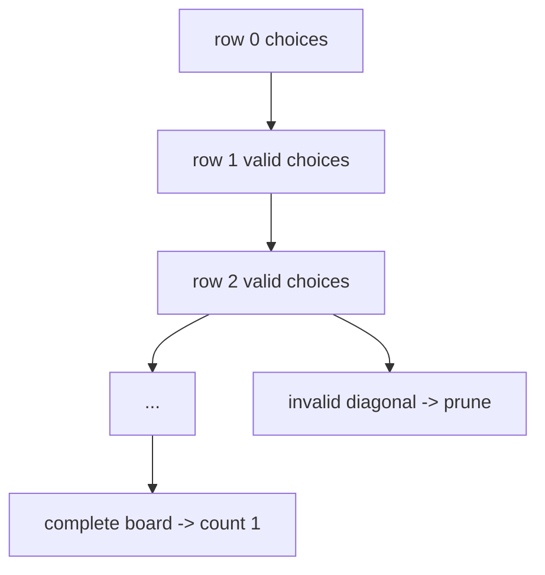

# N-Queens

The [N-Queens](https://www.csplib.org/Problems/prob054/) benchmark counts the
number of ways to place `n` queens on an `n x n` chessboard so that no two
queens attack each other. A queen attacks along its row, column, and both
diagonals. The search places one queen per row and recursively tries every
column that remains valid.

```cpp linenums="1"
for (int column = 0; column < n; ++column) {
  place(row, column);
  if (board_is_valid()) {
    count += search(row + 1);
  }
}
```



## Complexity

The benchmark measures this backtracking algorithm, not the decision version
of the mathematical problem. The decision version for an empty board is easy
for most \(n\), while counting all solutions is the expensive part.

The worst-case search tree is exponential. Because the algorithm places one
queen in each row and never allows two queens in the same column, a useful
loose upper bound is:

\[
T_1 = \mathcal{O}(n!)
\]

because at most one queen can occupy each column. Diagonal checks prune many
branches, but the amount of pruning depends strongly on the partial board.
There is no simple closed-form solution count for general \(n\); see the
[Algorithm Wiki summary](https://algorithm-wiki.csail.mit.edu/wiki/N-Queens_Problem)
for references on known algorithm families and bounds.

The longest dependency chain places one queen per row:

\[
T_\infty = \mathcal{O}(n)
\]

## Scaling

N-Queens is an irregular recursive search benchmark. Branches near the top of
the tree can contain very different numbers of valid descendants, so static
partitioning is fragile.

Good scaling requires enough search subtrees to balance workers. Very fine
tasks improve balance but increase scheduler overhead and duplicate board-state
management.

N-Queens is closest to [knapsack](knapsack.md) in the suite: both are recursive
backtracking searches with pruning.

## Benchmark sizes

The following problem sizes are available:

| Name | Board |
|------|-------|
| test | `8 x 8` |
| base | `14 x 14` |

## Results

TODO: results
