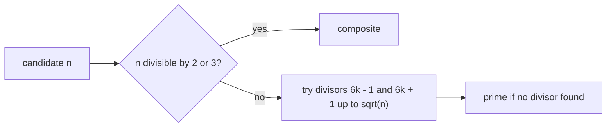

# Primes

The primes benchmark counts prime numbers below `n` using trial division. The
primality test handles small divisors first and then checks candidates of the
form \(6k \pm 1\):

```cpp linenums="1"
for (std::int64_t i = 5; i * i <= n; i += 6) {
  if (n % i == 0 || n % (i + 2) == 0) {
    return false;
  }
}
```

The \(6k \pm 1\) rule is a small arithmetic filter. Every integer is congruent
to `0`, `1`, `2`, `3`, `4`, or `5` modulo 6. Values congruent to `0`, `2`, or
`4` are divisible by 2, and values congruent to `3` are divisible by 3. After
testing divisibility by 2 and 3, only residues `1` and `5` can still be prime;
`5` is the same as \(-1\) modulo 6.



The benchmark validates the configured sizes against known values of the
prime-counting function.

## Complexity

Testing one number \(x\) by trial division costs \(\mathcal{O}(\sqrt{x})\) in
the worst case. Counting all primes below \(n\) is therefore bounded by:

\[
T_1 = \mathcal{O}(n^{3/2})
\]

Each candidate number is independent, so the span is dominated by the most
expensive single primality test plus the final reduction:

\[
T_\infty = \mathcal{O}(\sqrt{n})
\]

## Scaling

Primes is a wide data-parallel benchmark with heterogeneous task costs. Larger
candidate numbers and prime candidates take longer to test than small composite
numbers.

Chunking contiguous ranges creates predictable memory access but uneven work.
Dynamic scheduling or smaller chunks improve load balance at the cost of more
task overhead.

This benchmark is similar to [Mandelbrot](mandelbrot.md): each element can be
processed independently, but some elements are much more expensive than others.

## Benchmark sizes

The following problem sizes are available:

| Name | Count primes below | Expected count |
|------|---------------------|----------------|
| test | `100'000` | `9'592` |
| base | `10'000'000` | `664'579` |

## Results

TODO: results
