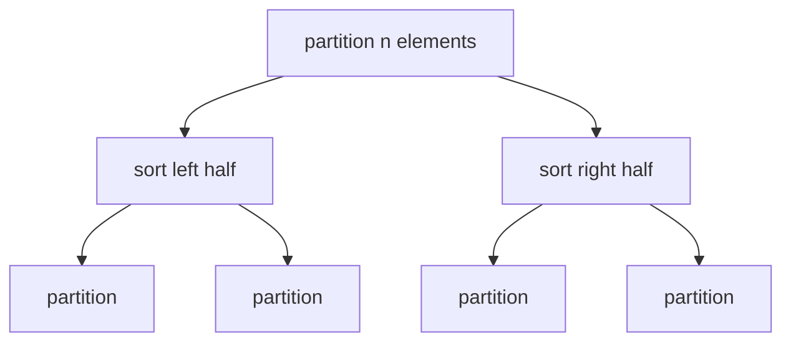

# Quicksort

The quicksort benchmark follows nowa's in-place quicksort over deterministic
`rand()` input. It partitions around the middle-element pivot with two moving
pointers, then sorts the two partitions recursively:

```cpp linenums="1"
int pivot = a[n / 2];
while (left <= right) {
  if (*left < pivot) ++left;
  else if (*right > pivot) --right;
  else swap(*left++, *right--);
}
quicksort(a, right - a + 1);
quicksort(left, a + n - left);
```

The benchmark validates that the final array is sorted.



## Complexity

For the benchmark's deterministic random input, the useful model is average
case with balanced partitions. Quicksort performs linear partitioning work at
each level:

\[
T_1 = \mathcal{O}(n \log n)
\]

The worst case is quadratic if the pivot repeatedly creates one empty or tiny
partition, but that is not the intended operating point of this benchmark:

\[
T_1 = \mathcal{O}(n^2)
\]

The partition itself is not parallel. Even with balanced partitions, the span is
therefore:

\[
T_\infty(n) = T_\infty(n / 2) + \mathcal{O}(n) = \mathcal{O}(n)
\]

because each level must complete a serial partition before the two recursive
sorts can proceed.

## Scaling

Quicksort exposes divide-and-conquer parallelism after each partition. The two
recursive calls are independent, but their sizes depend on the pivot, so the
task graph is less regular than mergesort.

Partitioning is branch-heavy and memory-bandwidth sensitive. The benchmark also
copies the deterministic source array into a work buffer inside each measured
iteration, so copy bandwidth is part of the result.

Quicksort is a useful contrast with [mergesort](mergesort.md): both are
divide-and-conquer sorts, but quicksort has cheaper in-place partitioning and a
less predictable task graph.

## Benchmark sizes

The following problem sizes are available:

| Name | Elements |
|------|----------|
| test | `10'000` |
| base | `100'000'000` |

## Results

TODO: results
