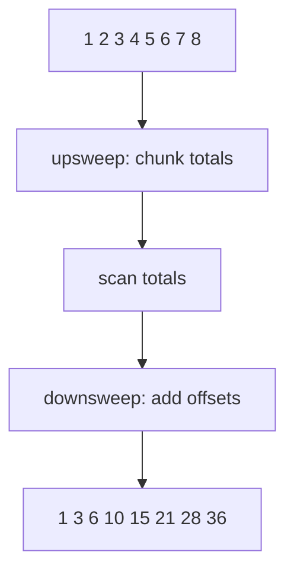

# Scan

The scan benchmark computes an inclusive prefix sum over the input sequence
`1, 2, ..., n`:

```cpp linenums="1"
out[i] = in[0] + in[1] + ... + in[i];
```

The serial projection uses `std::inclusive_scan`. Each benchmark iteration
repeats the scan many times and checks that the last output element is
\(n(n + 1) / 2\), modulo 32-bit unsigned arithmetic.

[Prefix sum](https://en.wikipedia.org/wiki/Prefix_sum) is also called scan. It
is a classic example of an operation that looks sequential but has efficient
parallel implementations.



## Complexity

For one scan over \(n\) elements, the work is:

\[
T_1 = \mathcal{O}(n)
\]

Parallel scan is usually implemented as an upsweep and downsweep over chunks,
giving logarithmic dependency depth:

\[
T_\infty = \mathcal{O}(\log n)
\]

The benchmark stores both input and output arrays, so the space complexity is
\(\mathcal{O}(n)\).

## Scaling

Scan can be viewed as either a homogeneous divide-and-conquer algorithm or a
bulk-parallel primitive, depending on the implementation. It has more
synchronization than [fold](fold.md) because prefix sums must propagate chunk
totals back into later chunks.

Scaling is limited by memory bandwidth, the number of global scan phases, and
the fixed per-iteration synchronization cost. Repeating the scan reduces timing
noise for small inputs.

## Benchmark sizes

The following problem sizes are available:

| Name | Elements | Repetitions |
|------|----------|-------------|
| test | `1'000` | `1'000` |
| base | `8'000` | `1'000` |

## Results

TODO: results
