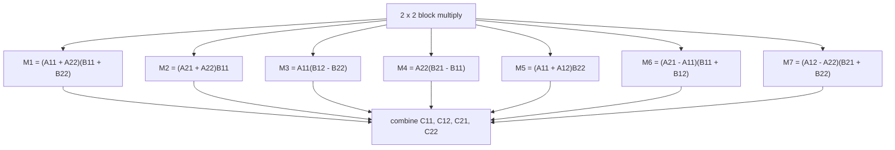

# Strassen

The Strassen benchmark computes `C = A * B` for square `float` matrices using
Strassen's seven-product divide-and-conquer algorithm. Each recursive step
forms temporary matrix sums and differences, computes seven half-size products,
and combines them into the four output quadrants.

The recursion stops at a conventional cubic base case.

## Complexity

Strassen's recurrence is:

\[
T_1(n) = 7T_1(n / 2) + \mathcal{O}(n^2)
\]

By the [master theorem](https://en.wikipedia.org/wiki/Master_theorem_%28analysis_of_algorithms%29):

\[
T_1 = \mathcal{O}(n^{\log_2 7})
\]

which is approximately \(\mathcal{O}(n^{2.807})\). The implementation allocates
temporary matrices at each recursive level, so memory traffic is a major part
of the benchmark.

## Scaling

The seven products are independent and expose regular divide-and-conquer
parallelism. The matrix additions, subtractions, and final combination are
bulk work around those recursive tasks.

For these sizes, Strassen is a tasking benchmark rather than a tuned linear
algebra kernel. Scaling depends on the cutoff, temporary allocation behavior,
cache locality, and floating-point error tolerance.

This benchmark is directly comparable to [matrix multiply](matmul.md): both
split matrices into quadrants, but Strassen trades extra additions and
temporaries for one fewer recursive product.

## Benchmark sizes

The following problem sizes are available:

| Name | Matrix size | Cutoff |
|------|-------------|--------|
| test | `64 x 64` | `64 x 64` |
| base | `1024 x 1024` | `64 x 64` |

## Results

TODO: results
