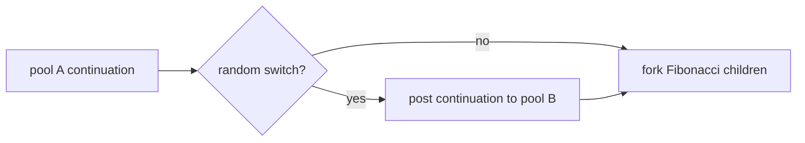

# Random Scheduler Switch

The random scheduler-switch benchmark runs recursive Fibonacci while
occasionally migrating the current continuation between two scheduler pools.
At each internal node, deterministic SplitMix64-derived state gives an
approximately 10 percent chance of switching pools before spawning the two
children.

The computed value is still `fib(n)`, so the benchmark is checked against the
same iterative Fibonacci reference as the ordinary Fibonacci benchmark.

## Complexity

The task graph has the same exponential size as recursive Fibonacci:

\[
S(n) = 2F(n + 1) - 1
\]

The span is linear in \(n\), but some nodes add an explicit cross-pool post
before continuing.

## Scaling

This is a libfork-specific stress test for scheduler mobility. It should scale
worse than ordinary Fibonacci because a fraction of continuations move between
worker pools.

The benchmark isolates cross-pool posting, continuation resumption, and
type-erased scheduler overhead. It requires at least two workers so the worker
set can be split between the two pools.

This is the scheduler-switch counterpart to [Fibonacci](fib.md): the task graph
is the same shape, but some continuations migrate between pools.

## Benchmark sizes

The following problem sizes are available:

| Name | `fib(n)` | Switch probability |
|------|----------|--------------------|
| test | `8` | about `10%` |
| base | `37` | about `10%` |

The total worker count is split between pool A and pool B. Both mono and
type-erased busy-pool variants are registered.

## Results

TODO: results
