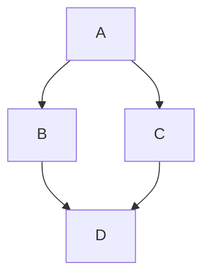

# Stack allocator API

TODO: move to docs page

This is an internal design document meant for library contributors/maintainers.

A `stack_allocator` in libfork has the following API:

```mermaid
graph TD;
    A-->B;
    A-->C;
    B-->D;
    C-->D;
```
