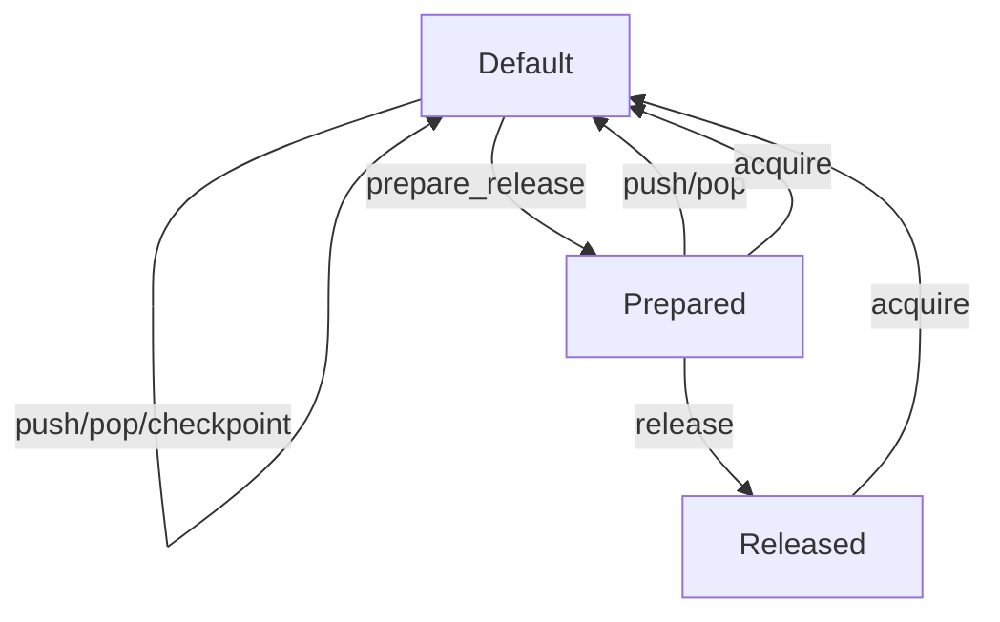

# Stack allocator API

TODO: move to docs page

This is an internal design document meant for library contributors/maintainers.

The `stack_allocator` has:

- A handle: the object/instance that satisfies the concept.
- The logical-stack: where the allocations are made.

A `stack_allocator` in libfork has the following API:

- Push/Pop:
  - Push has no pre-conditions.
  - Pop operates FILO with push.
- Checkpoint:
  - This produces a checkpoint to the logical-stack
- Prepare-release:
  - Makes the logical-stack ready for another thread to acquire it (via a checkpoint)
  - Must be called before releasing the stack.
  - Must be called before any thread can acquire the stack.
- Release on checkpoint `x`:
  - Triggers release of ownership of the logical-stack from the handle.
  - Will be called if another thread calls acquire on the stack.
  - May be called before or after the acquire call.
- Force-acquire on checkpoint `x`:
  - Makes the handle own the logical-stack that the checkpoint `x` belongs to.
  - Only called when the current logical-stack has no allocations on it.
  - Guaranteed that `x` did not come from this stack.
- Relaxed-acquire on checkpoint `x`:
  - Makes the handle own the logical-stack that the checkpoint `x` belongs to.
  - Either:
    - The current logical-stack contains `x` (then this is a no-op).
    - The current logical-stack is empty (then this is a force-acquire).

Not all operations can be called at any time, the state machine is as follows:

